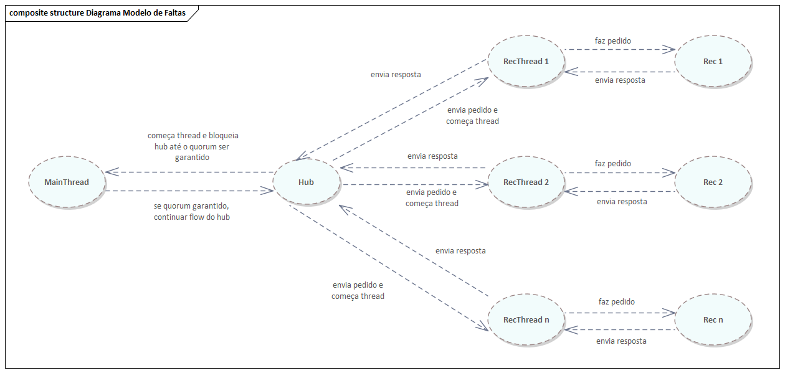

# Relatório do projeto *Bicloin*

Sistemas Distribuídos 2020-2021, 2º semestre

## Autores

**Grupo A59**

| Número | Nome              | Utilizador                                     | Correio eletrónico                       |
| -------|-------------------|------------------------------------------------| -----------------------------------------|
| 92426  |  António Pedro    |  https://git.rnl.tecnico.ulisboa.pt/ist192426  | pedro.paredes.branco@tecnico.ulisboa.pt  |
| 92448  |  David Pissarra   |  https://git.rnl.tecnico.ulisboa.pt/ist192448  | david.pissarra@tecnico.ulisboa.pt        |
| 92502  |  Jorge Godinho    |  https://git.rnl.tecnico.ulisboa.pt/ist192502  | jorge.godinho@tecnico.ulisboa.pt         |

 

## Melhorias da primeira parte

- [Melhoria nos acessos ao servidor de nomes (ZooKeeper)](https://git.rnl.tecnico.ulisboa.pt/SD-20-21-2/A59-Bicloin/commit/9f372ef7eb091da8c3aa9770b7beaf9fcf89cc3d)
- [Mudança de mensagens a mostrar ao utilizador](https://git.rnl.tecnico.ulisboa.pt/SD-20-21-2/A59-Bicloin/commit/e75e5708d9a53a7c6b38769eea479506c82052a9)
- [Melhoria na execução dos testes](https://git.rnl.tecnico.ulisboa.pt/SD-20-21-2/A59-Bicloin/commit/3916bd28e6a1aec46cefe39e44e9a58b83988ca3)

## Modelo de faltas

Na nossa solução da segunda do projeto Bicloin de Sistemas Distribuídos, são toleradas faltas silenciosas. Isto é, faltas como terminar abruptamente o processo que corre uma réplica rec. Visto que a nossa solução implementa uma versão do protocolo de replicação ativa, a nossa versão simples da segunda parte deste projeto suporta n faltas silenciosas caso existam 2*n + 1 réplicas (visto que na nossa implementação não otimizada vamos formar quoruns de tamanho fixo igual a n + 1 réplicas). Na nossa versão otimizada (onde exploramos melhor o rácio entre escritas e leituras, e trabalhamos com as respetivas proporções no calculo dos quoruns) podemos por vezes permitir menos ou mais faltas, normalmente permitimos mais faltas para leitura e menos faltas para escrita (pois de facto, existiram muitas mais leituras do que escritas, logo precisamos de maiores quóruns para escritas e menores quoruns para leituras). A nossa implementação base (não otimizada) também permite a existência de n falhas internas (como erros internos desconhecidos) visto que quando alcançamos um quorum, sabemos que teremos coerência no resultado que vai ser lido ou escrito, executando imediatamente a operação pretendida.

## Solução

A nossa solução consiste no recurso a threads de modo a suportar o paralelismo de operações do Hub, visto que este será 'multi-threaded', e o paralelismo nos acessos a todos os recs. Deste modo, vamos criar uma thread principal (MainThread como o diagrama UML indica) que vai aguardar pelas respostas das réplicas do rec. Esta troca de informação entre o hub e as réplicas do rec vai ser suportada por uma thread por réplica. A esta thread será atribuida uma réplica (ou seja um registo do servidor de nomes ZooKeeper) que vai assim enviar um pedido a essa réplica, receber a respetiva resposta, guardar esta resposta numa lista sincronizada com as restantes threads e informar as outras threads da sua ação.

## Protocolo de replicação

Para a solução do nosso trabalho implementámos uma versão do protocolo de replicação ativa. Este protocolo corresponde a ter o servidor rec com várias réplicas, e ajuda de modo a que faltas sejam suportadas. Para isto, quer para leituras quer para escritas, são acedidas várias réplicas para fazer o mesmo pedido, de modo a que haja uma interseção entre as réplicas onde se escreve e onde se lê. Assim garante-se consistência nos valores lidos e a performance é maior do que se não fosse aplicado nenhum protocolo de replicação, mas existindo réplicas.

## Medições de desempenho

Para medir o desempenho do nosso sistema, decidimos criar 3 padrões de comandos (em formato txt, todos com tamanhos iguais) e executá-los 3 vezes de modo a efetuar a medição do tempo de execução do sistema. Visto que vamos ter em conta o rácio de leituras em relação a escritas, sabemos que o sistema ao longo da sua execução irá dimunuir o tamanho dos quoruns para as leituras. Deste modo, como existirão muitas mais leituras do que escritas saberemos que as execuções posteriores do sistema irão ser significativamente mais rápidas.

A tabela abaixo representa 4 execuções de cada um dos testes, sem desligar o servidor hub, acumulando assim os rácios de escrita e leitura, o que justifica a diminuição dos tempos de execução do sistema ao longo das execuções. A partir da 4ª execução os tempos estabilizam visto que os rácios atigem um valor constante.

| Tipo do Teste                    | Tempo 1ª execução (s) | Tempo 2ª execução (s) | Tempo 3ª execução (s) | Tempo 4ª execução (s) |
| :---                             |         :----:        |         :----:        |         :----:        |                  ---: |
| Balance/Top-Up                   | 12.864 s              | 9.354 s               | 7.530 s               | 7.862 s               |
| Bike-Up/Bike-Down/Top-Up         | 27.347 s              | 19.169 s              | 17.760 s              | 17.104 s              |
| Bike-Up/Bike-Down/Top-Up/Balance | 16.525 s              | 12.444 s              | 7.240 s               | 8.278 s               |

## Opções de implementação

No nosso sistema, decidimos implementar 3 otimizações. A primeira consistiu em implementar paralelismo no hub (Threads do Java). Desta forma todas as trocas de informação com as réplicas do rec serão paralelas. A segunda foi transformar as chamadas remotas, que eram síncronas na primeira parte do projeto, em chamadas assíncronas, não tendo assim o hub de ficar bloqueado à espera de respostas do rec. Por último decidimos ter em conta os rácios de leituras e escritas. Desta forma poderemos calcular um novo tamanho para os quoruns, melhorando bastante o desempenho do sistema a longo prazo (após inserção de múltiplos comandos).

### **Tempos de execução versão otimizada**

| Tipo do Teste                    | Tempo 1ª execução (s) | Tempo 2ª execução (s) | Tempo 3ª execução (s) | Tempo 4ª execução (s) |
| :---                             |         :----:        |         :----:        |         :----:        |                  ---: |
| Balance/Top-Up                   | 12.864 s              | 9.354 s               | 7.530 s               | 7.862 s               |
| Bike-Up/Bike-Down/Top-Up         | 27.347 s              | 19.169 s              | 17.760 s              | 17.104 s              |
| Bike-Up/Bike-Down/Top-Up/Balance | 16.525 s              | 12.444 s              | 7.240 s               | 8.278 s               |

### **Tempos de execução versão base**

| Tipo do Teste                    | Tempo de execução (s) |
| :---                             |                  ---: |
| Balance/Top-Up                   | 20.471 s              |
| Bike-Up/Bike-Down/Top-Up         | 30.585 s              |
| Bike-Up/Bike-Down/Top-Up/Balance | 23.101 s              |

## Notas finais

Na última otimização descrita acima, o nosso grupo decidiu que para o cálculo dos rácios de escrita e leitura, terá de existir pelos menos 5 réplicas do rec para que existam resultados significativos. Por outro lado se ainda não houve nenhuma escrita também não queremos que o rácio de escrita seja igual a 1 para evitar valores irrealistas. Também não permitimos (quando existem rácios de leitura muito elevados) que existam quoruns com o mesmo número de réplicas existentes, visto que neste caso deixariamos de tolerar faltas. Este cálculo do tamanho dos quoruns respeita as seguintes condições: **Tamanho Quorum Escrita + Tamanho Quorum Leitura > Número de Réplicas** (interseção leituras-escritas), **Tamanho Quorum Escrita > Número de Réplicas / 2** (interseção escritas) .